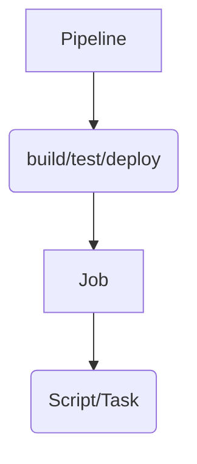

## Azure DevOps

### Mermaid



* Types and syntax:
    - **graph** TD - defines a graph
    - **Sequence** - defines a sequence diagram
    - **Gantt** - defines a gantt diagram
    - **ClassDiagram** - defines a class diagram
    - **StateDiagram** - defines a state diagram
    - **Pie** - defines a pie diagram
    - **Flowchart** - defines a flow chart diagram

```
::: mermaid
classDiagram
    Pipeline <|-- Stage
    class Stage
:::
```

### Azure pipelines

* Type of pipelines: **build** and **release**
    - When creating a build or release pipeline, you can specify which pool it uses, organization, or project scope.

* Environment represents a collection of resources targeted for deployment
  
* Caching is available in YAML and classic build pipelines

* In Azure DevOps, there are 4 types of jobs available:
    - **Agent pool jobs**: run on an agent that is part of an agent pool
    - **Container jobs**: run in a container on an agent part of an agent pool
    - **Deployment group jobs**:  run on systems in a deployment group
    - **Agentless jobs**: run directly on the Azure DevOps also-often-called **Server Jobs**


* The agent always starts this communication (pull model). All the messages from the agent to Azure Pipelines over HTTPS, depend on how you configure the agent.
* The agent downloads a listener OAuth token and uses it to listen to the job queue
* The maximum duration of a build running on the Microsoft-hosted agent is  **6h**
* Connect self-hosted agent pool to **Azure Pipelines**: A PAT is used to connect a self-hosted agent to Azure Pipelines
* Only self-hosted agents support incremental builds.

  
* Azure DevOps project using a Git repository auth methods:
    - SSH authentication is used when Git Credential Manager or personal access tokens PATs are not allowed
    - OAuth is used for REST APIs only. Active Directory is used for on-premises deployments only.

* Which two features are present in Azure Pipelines, but NOT in GitHub Actions?
    - deployment groups
    - service connections

---

* App Services include provisions for implementing staging environments and deploying apps (including .NET Core apps).

    -  implement a staging environment and perform a blue-green deployment

--- 

## Application Insights 

* will tell you about any performance issues and exceptions, and help you find and diagnose the root causes.
* Exceptions in your live web app are reported by Application Insights.
* Azure **Application Insight** availability test and alert:
    - URL ping and Standard test: a simple test you can create in the Azure portal.
    - Multi-step web test: a more advanced test that you can create in Visual Studio Enterprise and upload to the portal.
    - Custom track availability: a test that you can create in code, using the Application Insights SDK.
* Application Insights can monitor both Java and ASP.NET web applications and services, WCF services. They can be hosted on-premises, on VMs, or as Microsoft Azure websites.
* Application Insights provides direct integration with Azure Boards

## Smart detection

* Smart detection automatically warns you of potential performance problems and failure anomalies in your WEB application.
* It performs proactive analysis of the telemetry that your app sends to **Application Insights**

---

## Logic Apps

* Service that allows to run automated workflows with little to no code
* Automate reports with Logic Apps
* Move uploaded files from an SFTP or FTP server to Azure Storage.

----

## Azure Log Analytics 

* IT Service Management Connector (ITSM) connects Azure with the following ITSM tools: ServiceNow, System Center Service Manager, Provance, Cherwell

---

## Azure Monitor Logs

* Azure Monitor Logs is based on Azure Data Explorer and uses the same **Kusto Query Language (KQL)**
    - A Kusto query is a read-only request to process data and return results
    - KQL is a powerful tool to explore your data and discover patterns, identify anomalies and outliers, create statistical modeling, and more. The query uses schema entities that are organized in a hierarchy similar to SQLs: databases, tables, and columns.
 

